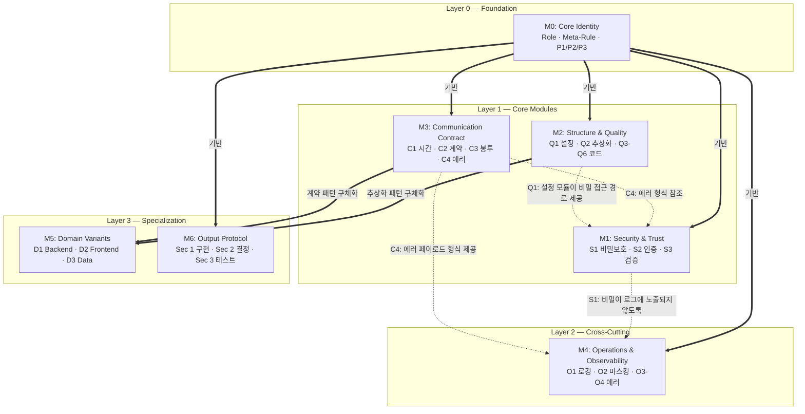

# Global Developer System Prompt v4 — 모듈라이징 종합 분석

## 0. 글로벌 프롬프트 구성 및 사용법

**1. 간단 글로벌 프롬프트 모든 엔지니어의 global rule로 활용 가능** 
https://github.com/Jinhan-Han-Jeremy/vibecoding-prompt-sample/blob/main/system-prompt/universal-developer-prompt.md?plain=1

**2. m0 ~ m6 다각화된 rule로 활용 가능**
- m0를 기반으로 특정 position에 맞게 ai가 global 프롬프트를 유기적으로 활용
- **주의 :** 개발할려는 목표를 잘못명시할 경우, ai가 오버엔지니어링 발생 가능성 존재, 목적에 맞지 않는 구성으로 개발 가능성 존재  
https://github.com/Jinhan-Han-Jeremy/vibecoding-prompt-sample/blob/main/system-prompt/m0-core-identity.md

---

## 1. 프롬프트 구조 진단

### 1-1. 원본 구조 vs 모듈화 구조 대비

| 항목 | 원본 (v4) | 모듈화 후 |
|---|---|---|
| **파일 수** | 1개 (단일 파일) | 8개 (index + M0~M6) |
| **섹션 수** | 5개 (Role, Meta, Principles, Rules, Output) | 7개 독립 모듈 |
| **규칙 단위** | Rule 1~8 (번호 나열) | 22개 서브룰 (의미 단위) |
| **도메인 분기** | Rule 내부에 인라인 분기 | M5로 독립 분리 |
| **의존 관계** | 암시적 (문맥으로 추론) | 명시적 (Cross-Module References) |
| **조합 가능성** | 없음 (전부 로드) | 프리셋 조합 가능 |

### 1-2. 모듈화 후 구조 테이블

| 모듈 | 파일명 | 서브룰 | 줄 수 | 관심사 | 시점 | 범위 |
|---|---|---|---|---|---|---|
| **M0** | [m0-core-identity.md](file:///c:/Users/USER/Documents/github/testVibe/geminiTest/system-prompt/m0-core-identity.md) | — (3 섹션) | ~40 | 메타 | 항상 | 유니버설 |
| **M1** | [m1-security-trust.md](file:///c:/Users/USER/Documents/github/testVibe/geminiTest/system-prompt/m1-security-trust.md) | S1, S2, S3 | ~50 | 🔒 보안 | 구현 | 유니버설 |
| **M2** | [m2-structure-quality.md](file:///c:/Users/USER/Documents/github/testVibe/geminiTest/system-prompt/m2-structure-quality.md) | Q1~Q6 | ~70 | 🏗️ 구조 | 설계+구현 | 유니버설 |
| **M3** | [m3-communication-contract.md](file:///c:/Users/USER/Documents/github/testVibe/geminiTest/system-prompt/m3-communication-contract.md) | C1~C4 | ~60 | 📡 통신 | 설계 | 유니버설 |
| **M4** | [m4-operations.md](file:///c:/Users/USER/Documents/github/testVibe/geminiTest/system-prompt/m4-operations.md) | O1~O4 | ~70 | 👁️ 운영 | 구현 | 유니버설 |
| **M5** | [m5-domain-variants.md](file:///c:/Users/USER/Documents/github/testVibe/geminiTest/system-prompt/m5-domain-variants.md) | D1~D3 | ~60 | 🎯 혼합 | 설계+구현 | 도메인별 |
| **M6** | [m6-output-protocol.md](file:///c:/Users/USER/Documents/github/testVibe/geminiTest/system-prompt/m6-output-protocol.md) | Sec 1~3 | ~80 | 📋 행동 | 검증 | 유니버설 |

---

## 2. 분류 체계

### 2-1. 분류 트리

```mermaid
graph TD
    ROOT["Global Developer<br/>System Prompt v4"]

    ROOT --> AX1["축 1: 관심사<br/>(What)"]
    ROOT --> AX2["축 2: 적용 시점<br/>(When)"]
    ROOT --> AX3["축 3: 적용 범위<br/>(Where)"]

    AX1 --> SEC["🔒 보안/신뢰"]
    AX1 --> STR["🏗️ 구조/품질"]
    AX1 --> COM["📡 통신/계약"]
    AX1 --> OPS["👁️ 운영/관측"]

    SEC --> S1["S1 비밀 보호"]
    SEC --> S2["S2 경계 인증"]
    SEC --> S3["S3 입력 검증"]

    STR --> Q1["Q1 설정 구조"]
    STR --> Q2["Q2 추상화"]
    STR --> Q3["Q3 단일 책임"]
    STR --> Q4["Q4 파일 범위"]
    STR --> Q5["Q5 네이밍"]
    STR --> Q6["Q6 타입 안전"]

    COM --> C1["C1 시간 표준"]
    COM --> C2["C2 계약 타이핑"]
    COM --> C3["C3 응답 봉투"]
    COM --> C4["C4 에러 페이로드"]

    OPS --> O1["O1 구조화 로깅"]
    OPS --> O2["O2 민감 데이터 마스킹"]
    OPS --> O3["O3 도메인 에러 타입"]
    OPS --> O4["O4 문맥 기반 에러 핸들링"]

    AX2 --> DESIGN["📐 설계 시점"]
    AX2 --> IMPL["🔨 구현 시점"]
    AX2 --> VERIFY["✅ 검증 시점"]

    DESIGN --> D_M2["M2 Q2 추상화"]
    DESIGN --> D_M3["M3 C2 계약"]
    DESIGN --> D_M5["M5 도메인 패턴"]

    IMPL --> I_M1["M1 전체"]
    IMPL --> I_M2["M2 Q1,Q3-Q6"]
    IMPL --> I_M4["M4 전체"]

    VERIFY --> V_M6["M6 전체"]

    AX3 --> UNI["🌐 유니버설"]
    AX3 --> DOM["🎯 도메인별"]

    UNI --> U_LIST["M0 · M1 · M2 · M3 · M4 · M6"]
    DOM --> D_LIST["M5: Backend · Frontend · Data"]
```



### 2-2. 분류 체계 테이블

#### 축 1 — 관심사별 분류

| 관심사 | 모듈 | 서브룰 | 보호하는 품질 속성 | 원본 Rule |
|---|---|---|---|---|
| 🔒 **보안/신뢰** | M1 | S1, S2, S3 | Confidentiality, Integrity | Rule 1(일부), Rule 2 |
| 🏗️ **구조/품질** | M2 | Q1~Q6 | Maintainability, Readability | Rule 1(일부), Rule 3, Rule 8 |
| 📡 **통신/계약** | M3 | C1~C4 | Interoperability, Consistency | Rule 4, Rule 5 |
| 👁️ **운영/관측** | M4 | O1~O4 | Reliability, Debuggability | Rule 6, Rule 7 |

#### 축 2 — 적용 시점별 분류

| 시점 | 해당 서브룰 | 활동 |
|---|---|---|
| 📐 **설계** | Q2, C1, C2, C3, C4, D1~D3 | 아키텍처 결정, 인터페이스 설계, 프로토콜 선택 |
| 🔨 **구현** | S1~S3, Q1, Q3~Q6, O1~O4 | 코드 작성, 설정 관리, 검증 로직, 로깅 |
| ✅ **검증** | Sec 1~3 | 출력 검증, 테스트, 코드 리뷰 |

#### 축 3 — 적용 범위별 분류

| 범위 | 모듈 | 특성 |
|---|---|---|
| 🌐 **유니버설** | M0, M1, M2, M3, M4, M6 | 모든 도메인에 무조건 적용 |
| 🎯 **도메인별** | M5 (D1 Backend, D2 Frontend, D3 Data) | 해당 도메인에서만 적용 |

---

## 3. 인덱스 차트 (전체 조감도)

```
╔══════════════════════════════════════════════════════════════════════╗
║                    MODULE INDEX CHART v4                             ║
╠══════════════════════════════════════════════════════════════════════╣
║                                                                      ║
║  ┌─ M0: Core Identity ──────────────────────────────────────────┐   ║
║  │  Role Definition · Meta-Rule · Core Principles (P1/P2/P3)    │   ║
║  │  [메타 레벨 — 항상 로드, 의존성 없음]                          │   ║
║  └───────────────────────────┬────────────────────────────────────┘   ║
║                              │                                        ║
║          ┌───────────────────┼───────────────────┐                   ║
║          │                   │                   │                   ║
║          ▼                   ▼                   ▼                   ║
║  ┌─── M1 ────────┐  ┌─── M2 ────────┐  ┌─── M3 ────────┐         ║
║  │ Security       │  │ Structure     │  │ Communication  │         ║
║  │ & Trust        │  │ & Quality     │  │ Contract       │         ║
║  │                │  │               │  │                │         ║
║  │ S1 비밀 보호   │  │ Q1 설정 구조  │  │ C1 시간 표준   │         ║
║  │ S2 경계 인증   │  │ Q2 추상화    │  │ C2 계약 타이핑 │         ║
║  │ S3 입력 검증   │  │ Q3 단일 책임  │  │ C3 응답 봉투   │         ║
║  │                │  │ Q4 파일 범위  │  │ C4 에러 포맷   │         ║
║  │ 🔒 P3         │  │ Q5 네이밍    │  │                │         ║
║  │                │  │ Q6 타입 안전  │  │ 📡 P1 · P2    │         ║
║  │                │  │               │  │                │         ║
║  │                │  │ 🏗️ P1 · P2   │  │                │         ║
║  └────────┬───────┘  └────────┬──────┘  └────────┬───────┘         ║
║           │                   │                   │                  ║
║           │        ┌──────────┴──────────┐        │                  ║
║           │        ▼                     ▼        │                  ║
║           │  ┌─── M4 ───────────────────────┐     │                  ║
║           │  │ Operations & Observability    │     │                  ║
║           │  │                               │     │                  ║
║           │  │ O1 구조화 로깅                │     │                  ║
║           └──│ O2 민감 데이터 마스킹  ◄──────│─────┘                  ║
║              │ O3 도메인 에러 타입            │                        ║
║              │ O4 문맥 기반 에러 핸들링       │                        ║
║              │                               │                        ║
║              │ 👁️ P3                         │                        ║
║              └───────────────────────────────┘                        ║
║                              │                                        ║
║          ┌───────────────────┼───────────────────┐                   ║
║          ▼                                       ▼                   ║
║  ┌─── M5 ────────────────────────┐  ┌─── M6 ─────────────────┐     ║
║  │ Domain Variants               │  │ Output Protocol         │     ║
║  │                               │  │                         │     ║
║  │ D1 Backend: Ports & Adapters  │  │ Sec 1: 구현 출력        │     ║
║  │ D2 Frontend: Service Modules  │  │ Sec 2: 아키텍처 결정    │     ║
║  │ D3 Data: Source/Sink          │  │ Sec 3: 테스트 규약      │     ║
║  │                               │  │                         │     ║
║  │ 🎯 P2 · P1                   │  │ 📋 P1                  │     ║
║  │ [선택적 로드]                  │  │ [항상 로드]             │     ║
║  └───────────────────────────────┘  └─────────────────────────┘     ║
║                                                                      ║
╚══════════════════════════════════════════════════════════════════════╝
```

---

## 4. 모듈 간 의존 관계

### 4-1. 의존 관계 다이어그램



### 4-2. 의존 관계 매트릭스

읽는 법: **행 모듈**이 **열 모듈**에 의존함 (◆ = 구조 의존, ◇ = 참조 의존)

|  | M0 | M1 | M2 | M3 | M4 | M5 | M6 |
|---|---|---|---|---|---|---|---|
| **M0** | — | | | | | | |
| **M1** | ◆ | — | ◇ | ◇ | | | |
| **M2** | ◆ | ◇ | — | | | | |
| **M3** | ◆ | | | — | | | |
| **M4** | ◆ | ◇ | | ◇ | — | | |
| **M5** | | | ◆ | ◆ | | — | |
| **M6** | ◆ | | | | | | — |

### 4-3. 의존 관계 유형 설명

| 유형 | 기호 | 의미 | 예시 |
|---|---|---|---|
| **구조 의존** | ◆ (실선) | 반드시 함께 로드해야 함 | M5는 M2의 추상화 규칙을 전제로 동작 |
| **참조 의존** | ◇ (점선) | 해당 모듈의 규칙을 인지하고 따름 | M4는 M1의 비밀 보호 정책을 로깅에 적용 |

---

## 5. 구조화 이유 상세 설명

### 5-1. 왜 Rule 1을 M1 + M2로 분리했는가?

| 측면 | 설정 관리 (→ M2) | 비밀 보호 (→ M1) |
|---|---|---|
| **변경 트리거** | 아키텍처 리팩토링 | 보안 감사, 컴플라이언스 변경 |
| **담당 팀** | Platform / DevOps | Security / Compliance |
| **영향 범위** | 앱 시작 시 설정 로딩 | 전 계층의 데이터 노출 방지 |
| **원칙** | P1 Cohesion (구조적 일관성) | P3 Availability (장애 시 안전) |

> 하나의 Rule에 **변경 이유가 다른 두 관심사**가 혼합되면, 한쪽을 수정할 때 다른 쪽에 의도치 않은 영향이 갈 수 있습니다. SRP(Single Responsibility Principle)를 Rule 자체에도 적용한 것입니다.

### 5-2. 왜 Rule 3/5의 도메인 분기를 M5로 독립시켰는가?

| 문제점 | 해결 |
|---|---|
| Frontend 개발자가 Rule 3을 읽으면 Backend의 Ports & Adapters도 읽어야 함 | M5에서 D2만 참조하면 됨 |
| Rule 5의 응답 봉투 예외(Frontend)가 같은 Rule 안에 있어 혼란 | M5 D2에서 명시적으로 "봉투 구조는 서버 통신에만 적용"을 선언 |
| 새 도메인(ML/Mobile) 추가 시 기존 Rule 수정 필요 | M5에 D4를 추가하면 됨 — OCP(Open-Closed Principle) |

### 5-3. 왜 Rule 6 + Rule 7을 M4로 합쳤는가?

| 근거 | 설명 |
|---|---|
| **공통 목표** | 둘 다 "시스템이 문제가 생겼을 때 빠르게 파악하고 복구" 목적 |
| **실무 연관** | 에러 핸들링(Rule 7)의 결과가 로그(Rule 6)로 기록됨 — 항상 함께 사용 |
| **팀 소유권** | 둘 다 SRE/Platform 팀의 관할 |
| **원칙 일치** | 둘 다 P3 Availability가 Primary Principle |

### 5-4. 왜 M6에 Quick Reference를 통합했는가?

원본의 Quick Reference(Rule-to-Principle 매핑 테이블)는 **전체 프롬프트의 메타 정보**입니다. 모듈화 후에는:

- **Module-to-Principle 매핑**: M6에 통합 (AI가 출력 시 원칙을 인용할 때 참조)
- **Sub-Rule Origin 추적 테이블**: M6에 추가 (원본 Rule과의 대응 관계 유지)

이를 통해 AI가 **Architectural Decisions 섹션**을 작성할 때, 어떤 모듈의 어떤 서브룰이 어떤 원칙에 근거하는지 즉시 참조할 수 있습니다.

---

## 6. 서브룰 추적 매트릭스 (Origin Traceability)

원본 Rule이 어떤 모듈의 어떤 서브룰로 재배치되었는지 양방향 추적:

### 원본 → 모듈 (Forward Trace)

| 원본 Rule | 분리 내용 | 도착 모듈 | 서브룰 |
|---|---|---|---|
| Rule 1 | 설정 로딩, 기본값, graceful degradation | **M2** | Q1 |
| Rule 1 | 비밀 미노출, 시작 시 검증 | **M1** | S1 |
| Rule 2 | Auth/authz 경계 검증 | **M1** | S2 |
| Rule 2 | 입력 검증 + 구조화 에러 | **M1** | S3 |
| Rule 3 | 외부 의존 격리 (유니버설) | **M2** | Q2 |
| Rule 3 | Backend: Ports & Adapters | **M5** | D1 |
| Rule 3 | Frontend: Service Modules | **M5** | D2 |
| Rule 3 | Data: Source/Sink Connectors | **M5** | D3 |
| Rule 4 | UTC, ISO 8601, 클럭 주입 | **M3** | C1 |
| Rule 5 | 계약 타이핑, 버전 관리 | **M3** | C2 |
| Rule 5 | 응답 봉투 | **M3** | C3 |
| Rule 5 | 에러 페이로드 | **M3** | C4 |
| Rule 5 | DTO 분리 | **M3** | C2 |
| Rule 5 | Frontend 데이터 흐름 예외 | **M5** | D2 |
| Rule 6 | 로그 필드, 레벨 | **M4** | O1 |
| Rule 6 | 비밀/PII 마스킹 | **M4** | O2 |
| Rule 7 | 도메인 에러 타입 | **M4** | O3 |
| Rule 7 | 문맥 기반 핸들링 | **M4** | O4 |
| Rule 8 | 단일 책임 | **M2** | Q3 |
| Rule 8 | 파일 범위 | **M2** | Q4 |
| Rule 8 | 네이밍 | **M2** | Q5 |
| Rule 8 | 포매팅 + 타입 안전 | **M2** | Q6 |

### 모듈 → 원본 (Reverse Trace)

| 모듈 | 서브룰 | 원본 Rule | 분리 사유 |
|---|---|---|---|
| **M1** | S1 | Rule 1 | 보안 관심사를 설정 구조에서 분리 |
| **M1** | S2, S3 | Rule 2 | 그대로 이동 (관심사 일치) |
| **M2** | Q1 | Rule 1 | 구조 관심사를 보안에서 분리 |
| **M2** | Q2 | Rule 3 | 유니버설 패턴만 추출 |
| **M2** | Q3~Q6 | Rule 8 | 그대로 이동 (관심사 일치) |
| **M3** | C1 | Rule 4 | 그대로 이동 (관심사 일치) |
| **M3** | C2~C4 | Rule 5 | 유니버설 계약만 추출 |
| **M4** | O1, O2 | Rule 6 | 그대로 이동 (관심사 일치) |
| **M4** | O3, O4 | Rule 7 | 운영 관심사로 합류 |
| **M5** | D1~D3 | Rule 3 + 5 | 도메인 분기를 독립 모듈로 분리 |

---

## 7. 생성된 파일 목록

| 파일 | 역할 |
|---|---|
| [index.md](file:///c:/Users/USER/Documents/github/testVibe/geminiTest/system-prompt/index.md) | 모듈 레지스트리 + 조합 프리셋 |
| [m0-core-identity.md](file:///c:/Users/USER/Documents/github/testVibe/geminiTest/system-prompt/m0-core-identity.md) | 역할 · 메타규칙 · 핵심 원칙 |
| [m1-security-trust.md](file:///c:/Users/USER/Documents/github/testVibe/geminiTest/system-prompt/m1-security-trust.md) | 비밀 보호 · 인증 · 입력 검증 |
| [m2-structure-quality.md](file:///c:/Users/USER/Documents/github/testVibe/geminiTest/system-prompt/m2-structure-quality.md) | 설정 구조 · 추상화 · 코드 품질 |
| [m3-communication-contract.md](file:///c:/Users/USER/Documents/github/testVibe/geminiTest/system-prompt/m3-communication-contract.md) | 시간 표준 · API 계약 · 에러 형식 |
| [m4-operations.md](file:///c:/Users/USER/Documents/github/testVibe/geminiTest/system-prompt/m4-operations.md) | 로깅 · 마스킹 · 에러 핸들링 |
| [m5-domain-variants.md](file:///c:/Users/USER/Documents/github/testVibe/geminiTest/system-prompt/m5-domain-variants.md) | Backend · Frontend · Data 변형 |
| [m6-output-protocol.md](file:///c:/Users/USER/Documents/github/testVibe/geminiTest/system-prompt/m6-output-protocol.md) | 출력 형식 · 테스트 · Quick Reference |
